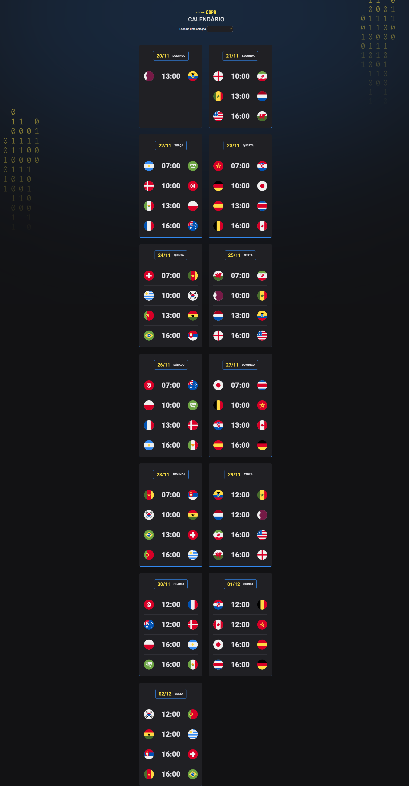

<h1 align="center">⚽ NLW COPA ⚽</h1>

Evento exclusivo e gratuito, promovido pela Rocketseat para ensino de tecnologias WEB.

  <a href="#-tecnologias">Tecnologias</a>&nbsp;&nbsp;&nbsp;|&nbsp;&nbsp;&nbsp;
  <a href="#-projeto">Projeto</a>&nbsp;&nbsp;&nbsp;|&nbsp;&nbsp;&nbsp;
  <a href="#memo-licença">Licença</a>

 

  

## 🚀 Tecnologias

💻 Esse projeto foi desenvolvido com as seguintes tecnologias:

- HTML e CSS
- JavaScript

## 💻 Projeto
[Clique aqui!](https://gabriel-vitebo.github.io/nlw-copa/)

Esse é um calendário da copa de 2022, onde estão todos os jogos da fase de grupo, dia e horário. Nesse projeto você também pode escolher uma seleção, o que faz o fundo muda de cor de acordo com cada seleção.

## Licença

Esse projeto está sob a licença MIT.

---

contato: vitebo@outlook.com

Feito com ♥ by Rocketseat :wave: [Participe da nossa comunidade!](https://discord.gg/rocketseat)